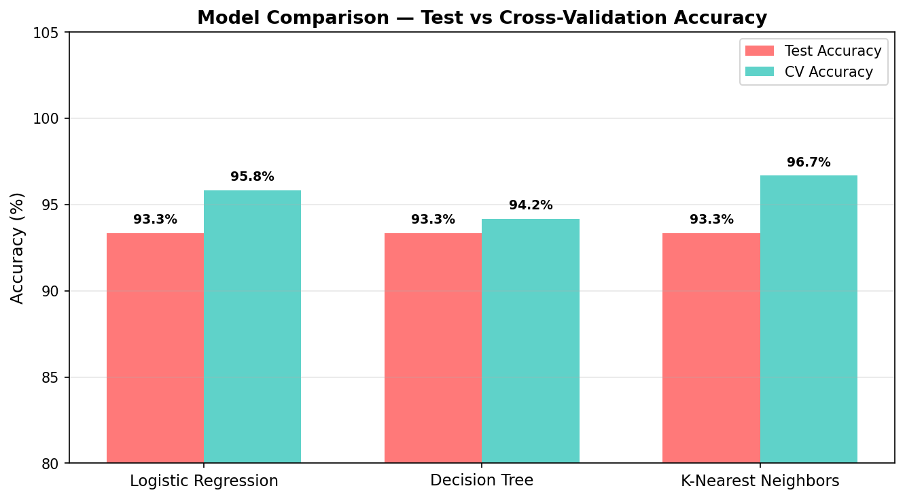
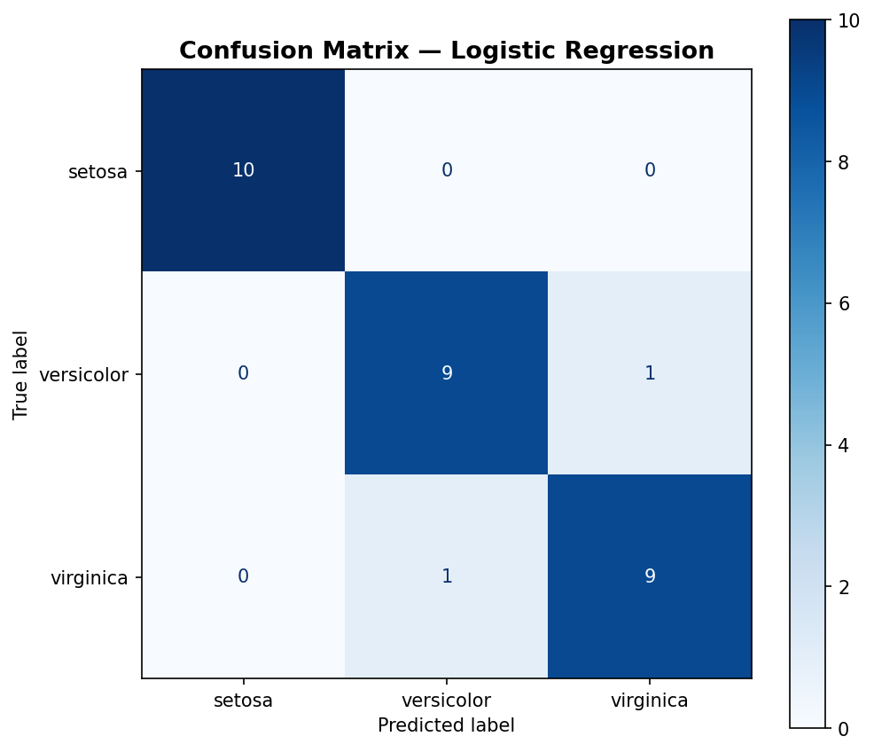

# 🌸 Iris Flower Classification

A beginner machine learning project that classifies iris flowers into 3 species — **Setosa**, **Versicolor**, and **Virginica** — using real-world measurements.



---

## 📁 Project Structure

```
iris-flower-classification/
├── data/
│   └── iris.csv              # Dataset (150 samples, 4 features)
├── notebooks/
│   └── iris_classification.ipynb  # Full walkthrough notebook
├── src/
│   ├── eda.py                # Exploratory Data Analysis
│   └── train.py              # Model training & evaluation
├── outputs/
│   ├── eda_distributions.png
│   ├── scatter_plots.png
│   ├── boxplots.png
│   ├── model_comparison.png
│   └── confusion_matrix.png
├── requirements.txt
└── README.md
```

---

## 📊 Dataset

The [Iris dataset](https://archive.ics.uci.edu/ml/datasets/iris) contains **150 samples** of iris flowers with:

| Feature | Description |
|---|---|
| sepal length (cm) | Length of the sepal |
| sepal width (cm) | Width of the sepal |
| petal length (cm) | Length of the petal |
| petal width (cm) | Width of the petal |
| species | Target: *setosa*, *versicolor*, *virginica* |

50 samples per class, perfectly balanced.

---

## 🤖 Models Used

| Model | Description |
|---|---|
| **Logistic Regression** | Linear classifier, great baseline |
| **Decision Tree** | Tree-based, easily interpretable |
| **K-Nearest Neighbors** | Distance-based, non-parametric |

All models achieve ~**93% accuracy** on the test set.

---

## 🚀 Getting Started

### 1. Clone the repo
```bash
git clone https://github.com/YOUR_USERNAME/iris-flower-classification.git
cd iris-flower-classification
```

### 2. Install dependencies
```bash
pip install -r requirements.txt
```

### 3. Run EDA
```bash
python src/eda.py
```

### 4. Train models
```bash
python src/train.py
```

### 5. Or explore the notebook
```bash
jupyter notebook notebooks/iris_classification.ipynb
```

---

## 📈 Results

All three models were evaluated using:
- **Test accuracy** (80/20 split)
- **5-fold cross-validation**

| Model | Test Accuracy | CV Accuracy |
|---|---|---|
| Logistic Regression | 93.3% | ~95% |
| Decision Tree | 93.3% | ~94% |
| K-Nearest Neighbors | 93.3% | ~95% |

### Confusion Matrix



---

## 🔍 Key Findings

- **Petal length and petal width** are the most discriminative features.
- **Setosa** is perfectly separable from the other two species.
- **Versicolor** and **Virginica** have slight overlap, making them harder to distinguish.
- Feature scaling (StandardScaler) improves Logistic Regression and KNN performance.

---

## 🛠️ Tech Stack

- **Python 3.9+**
- **pandas** — data manipulation
- **NumPy** — numerical operations
- **Matplotlib / Seaborn** — visualisation
- **scikit-learn** — ML models & evaluation

---

## 📚 Learning Resources

- [scikit-learn docs](https://scikit-learn.org/stable/)
- [Iris dataset — UCI ML Repository](https://archive.ics.uci.edu/ml/datasets/iris)
- [Machine Learning Crash Course — Google](https://developers.google.com/machine-learning/crash-course)

---

## 🙌 Author

Made as a beginner ML project. Feel free to fork, star ⭐, or open a PR!
